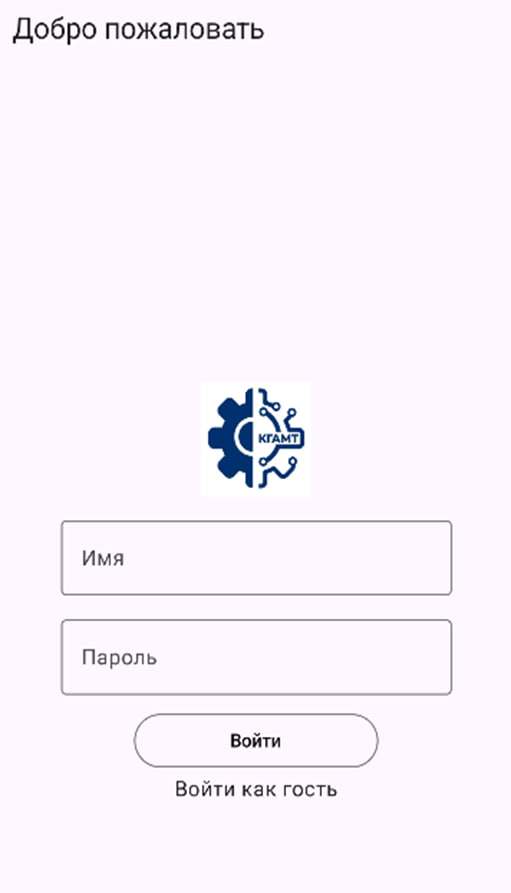
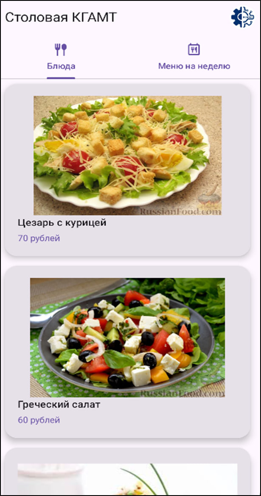
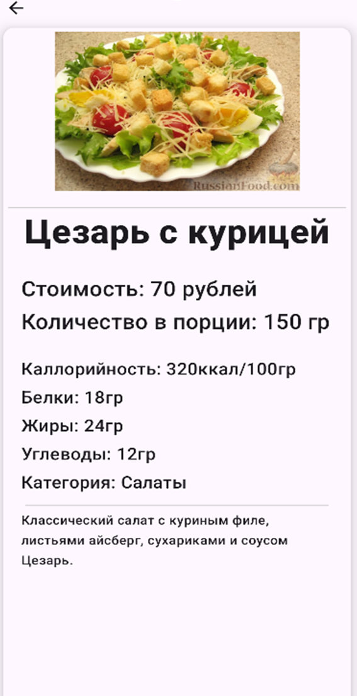
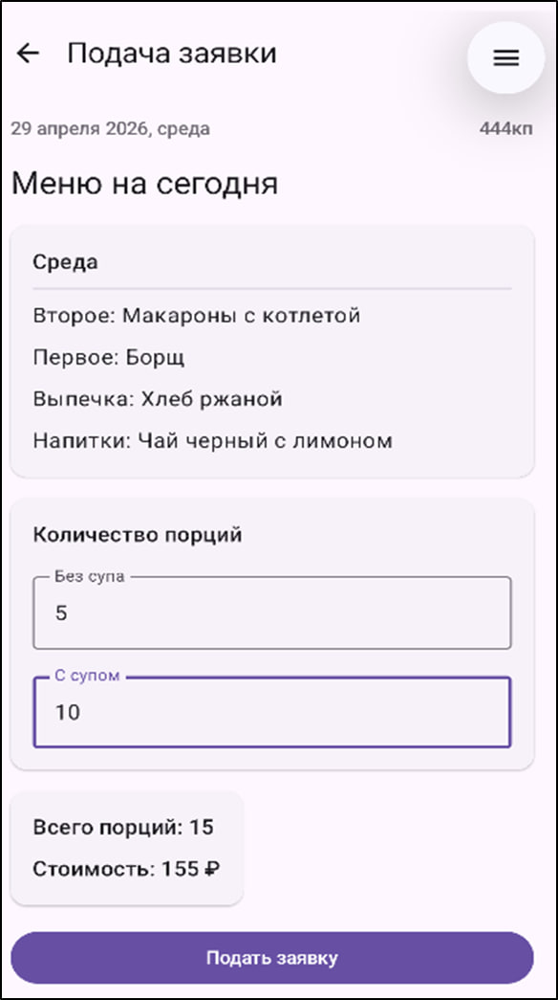
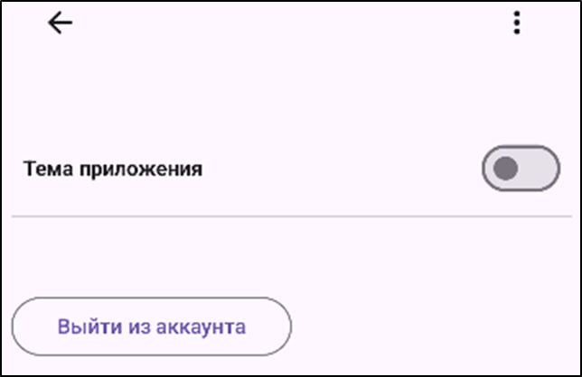
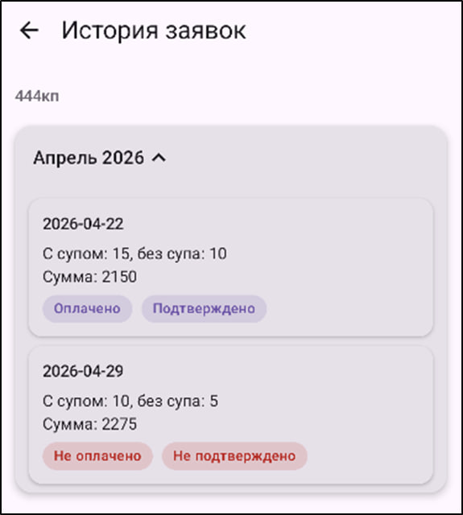

# 📚 Canteen mobile app
Modern Android application for students to see an actual menu of an educational institution

## ✨ Features

- JWT Authentication
- Browse daily menu and dishes
- Food request system
- Request history
- Filtering dishes by category
- App theme and language (russian & english) switching
- Persistent user session using DataStore
  
---

## 🏗 Architecture

The project is built using **Clean Architecture** with clear separation of concerns:

- **Presentation** (Compose, ViewModel)
- **Domain** (UseCases, Models)
- **Data** (Repository, REST API, DataStore)

### Layers responsibility

- **UI (Compose)** – renders state and sends events  
- **ViewModel** – manages UI state and user actions  
- **UseCase** – contains business logic and validation  
- **Repository** – orchestrates data sources including REST API
- **DataStore** – user session, theme and language settings  

---

## 🛠 Tech Stack

**Language**
- Kotlin  

**UI**
- Jetpack Compose  
- Navigation Compose  

**Architecture**
- Clean Architecture  
- MVVM  
- Repository Pattern  

**Async**
- Kotlin Coroutines  
- Flow  

**Data**
- REST API 
- DataStore  

**DI**
- Hilt  
 

---

| Login | Main Screen | Details |
|------|----------|--------|
|  |  |  |

| Request | Settings | Request History |
|---------|---------|--------|
|  |  |  | |

---
